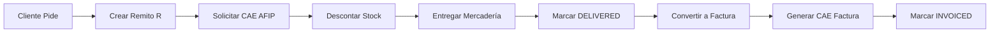
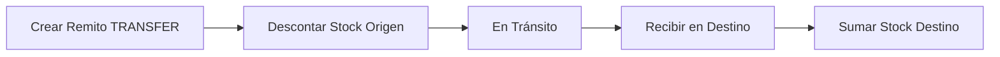
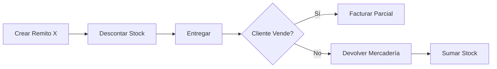
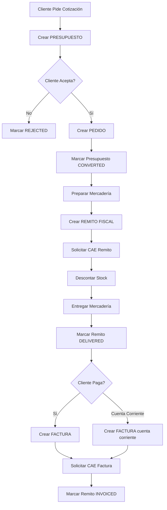

# Plan de Implementación: Remitos de Mercadería

## Contexto

Los **remitos** son comprobantes que documentan el traslado de mercadería sin transferencia de propiedad o sin facturación inmediata. Son fundamentales para:

1. **Entregas a clientes** antes de facturar (ej: cuenta corriente, entrega parcial)
2. **Traslados entre sucursales/depósitos**
3. **Devoluciones de mercadería**
4. **Consignaciones**
5. **Cumplimiento legal** (obligatorio en Argentina para transporte de mercadería)

---

## Tipos de Remitos

### 1. Remito X (No Fiscal)
- **Uso**: Traslados internos, devoluciones, consignaciones
- **No requiere autorización AFIP**
- **No afecta facturación**

### 2. Remito R (Fiscal)
- **Uso**: Entregas a clientes que luego se facturarán
- **NO REQUIERE CAE** (AFIP no autoriza remitos, solo facturas)
- **Debe tener numeración correlativa propia**
- **Se puede convertir en factura**
- **Descuenta stock temporalmente**

**IMPORTANTE**: En Argentina, los remitos NO requieren CAE de AFIP. Solo las facturas, notas de crédito y débito requieren CAE.

### 3. Remito de Transferencia
- **Uso**: Movimiento entre depósitos/sucursales
- **No requiere CAE**
- **Descuenta stock del origen, suma en destino**

---

## Decisión Arquitectónica: Tabla Separada `delivery_notes`

Similar a presupuestos, los remitos tienen su propio ciclo de vida y no son ventas.

### Razones:
1. **Ciclo de vida propio**: Estados diferentes (pendiente, en tránsito, entregado, facturado)
2. **Relación con ventas opcional**: Un remito puede existir sin venta asociada
3. **Datos específicos**: Transportista, domicilio de entrega, bultos, peso
4. **Stock temporal**: Puede reservar stock sin venderlo definitivamente
5. **Conversión a venta**: Similar a presupuestos, puede convertirse en factura

---

## Schema de Base de Datos

**Archivo:** `backend/prisma/schema.prisma`

```prisma
model DeliveryNote {
  id                String             @id @default(cuid())
  tenantId          String
  deliveryNumber    String             // REM-00001
  deliveryDate      DateTime           @default(now())
  deliveryType      DeliveryNoteType   // FISCAL, NON_FISCAL, TRANSFER

  // Cliente (para remitos a clientes)
  customerId        String?
  customer          Entity?            @relation("DeliveryNoteCustomer", fields: [customerId], references: [id], onDelete: SetNull)
  customerName      String?

  // Origen y Destino (para traslados)
  originWarehouseId    String?
  originWarehouse      Warehouse?      @relation("DeliveryNoteOrigin", fields: [originWarehouseId], references: [id])

  destinationWarehouseId String?
  destinationWarehouse   Warehouse?   @relation("DeliveryNoteDestination", fields: [destinationWarehouseId], references: [id])

  // Dirección de entrega (si es diferente a la del cliente)
  deliveryAddress      String?        @db.Text
  deliveryCity         String?
  deliveryState        String?
  deliveryPostalCode   String?

  // Datos de transporte
  transportCompany     String?        // Nombre de la empresa de transporte
  driverName          String?
  driverDocument      String?        // DNI del chofer
  vehiclePlate        String?        // Patente del vehículo
  packages            Int?           // Cantidad de bultos
  weight              Decimal?       @db.Decimal(10, 2) // Peso en kg

  // Estado
  status              DeliveryNoteStatus @default(PENDING)

  // Conversión a venta
  convertedToSaleId   String?        @unique
  convertedToSale     Sale?          @relation(fields: [convertedToSaleId], references: [id])
  convertedAt         DateTime?

  // Numeración fiscal (los remitos NO requieren CAE de AFIP)
  pointOfSaleId       String?        // Punto de venta
  pointOfSale         SalesPoint?    @relation(fields: [pointOfSaleId], references: [id])
  fiscalNumber        String?        // Número fiscal con formato (ej: 0001-00000123)

  // Notas
  notes               String?        @db.Text
  internalNotes       String?        @db.Text

  // Relaciones
  tenant              Tenant         @relation(fields: [tenantId], references: [id], onDelete: Cascade)
  items               DeliveryNoteItem[]

  // Auditoría
  createdBy           String
  creator             User           @relation(fields: [createdBy], references: [id])
  createdAt           DateTime       @default(now())
  updatedAt           DateTime       @updatedAt

  @@unique([tenantId, deliveryNumber])
  @@index([tenantId])
  @@index([customerId])
  @@index([status])
  @@index([deliveryDate])
  @@index([deliveryType])
  @@map("delivery_notes")
}

enum DeliveryNoteType {
  FISCAL        // Remito R (requiere CAE, para clientes)
  NON_FISCAL    // Remito X (sin CAE, uso interno)
  TRANSFER      // Traslado entre depósitos
}

enum DeliveryNoteStatus {
  PENDING       // Pendiente de despacho
  IN_TRANSIT    // En tránsito
  DELIVERED     // Entregado
  INVOICED      // Facturado (convertido a venta)
  CANCELLED     // Cancelado
  RETURNED      // Devuelto
}

model DeliveryNoteItem {
  id                String         @id @default(cuid())
  deliveryNoteId    String
  deliveryNote      DeliveryNote   @relation(fields: [deliveryNoteId], references: [id], onDelete: Cascade)

  lineNumber        Int

  // Producto
  productId         String?
  product           Product?       @relation(fields: [productId], references: [id], onDelete: SetNull)
  productSku        String?
  productName       String
  description       String?        @db.Text

  // Cantidad
  quantity          Decimal        @db.Decimal(15, 3)

  // Para remitos fiscales que se convertirán en facturas
  unitPrice         Decimal?       @db.Decimal(15, 2)

  // Estado del item
  deliveredQuantity Decimal        @default(0) @db.Decimal(15, 3) // Cantidad realmente entregada
  returnedQuantity  Decimal        @default(0) @db.Decimal(15, 3) // Cantidad devuelta

  @@index([deliveryNoteId])
  @@map("delivery_note_items")
}
```

---

## Flujos de Negocio

### Flujo 1: Remito Fiscal → Factura (Más Común)



**Pasos:**
1. Cliente hace un pedido (puede venir de un presupuesto aprobado)
2. Se crea un **Remito R** (fiscal)
3. Se solicita **CAE a AFIP** (código 91 - Remito R)
4. Se **descuenta stock** del depósito
5. Se imprime el remito y se **entrega la mercadería**
6. Se marca como **DELIVERED**
7. Cuando el cliente paga/acepta, se convierte en **Factura**
8. Se solicita nuevo **CAE** para la factura (código 01, 06 o 11 según tipo)
9. Se marca el remito como **INVOICED**

### Flujo 2: Traslado entre Depósitos



**Pasos:**
1. Se crea un **Remito de Transferencia**
2. Se **descuenta stock del depósito origen**
3. Estado **IN_TRANSIT**
4. Al recibir en destino, se marca **DELIVERED**
5. Se **suma stock al depósito destino**

### Flujo 3: Remito Sin Facturar (Consignación)



---

## Backend - Servicio de Remitos

**Archivo:** `backend/src/services/deliveryNoteService.ts`

```typescript
import { PrismaClient, DeliveryNoteType, DeliveryNoteStatus } from '@prisma/client'
import { Decimal } from '@prisma/client/runtime/library'
import { AppError } from '../middleware/errorHandler.js'
import { afipService } from './afipService.js'

interface CreateDeliveryNoteItemInput {
  productId: string
  quantity: number
  unitPrice?: number
  description?: string
}

interface CreateDeliveryNoteInput {
  deliveryType: 'FISCAL' | 'NON_FISCAL' | 'TRANSFER'
  customerId?: string
  originWarehouseId?: string
  destinationWarehouseId?: string
  items: CreateDeliveryNoteItemInput[]
  deliveryAddress?: string
  deliveryCity?: string
  deliveryState?: string
  deliveryPostalCode?: string
  transportCompany?: string
  driverName?: string
  driverDocument?: string
  vehiclePlate?: string
  packages?: number
  weight?: number
  notes?: string
  shouldRequestCAE?: boolean // Para remitos fiscales
}

export class DeliveryNoteService {
  constructor(
    private prisma: PrismaClient,
    private tenantId: string,
    private userId: string
  ) {}

  /**
   * Crear remito
   */
  async createDeliveryNote(data: CreateDeliveryNoteInput) {
    const {
      deliveryType,
      customerId,
      originWarehouseId,
      destinationWarehouseId,
      items: itemsInput,
      deliveryAddress,
      deliveryCity,
      deliveryState,
      deliveryPostalCode,
      transportCompany,
      driverName,
      driverDocument,
      vehiclePlate,
      packages,
      weight,
      notes,
      shouldRequestCAE = true
    } = data

    // Validaciones según tipo de remito
    if (deliveryType === 'FISCAL' && !customerId) {
      throw new AppError('Remito fiscal requiere cliente', 400)
    }

    if (deliveryType === 'TRANSFER') {
      if (!originWarehouseId || !destinationWarehouseId) {
        throw new AppError('Remito de transferencia requiere origen y destino', 400)
      }
      if (originWarehouseId === destinationWarehouseId) {
        throw new AppError('Origen y destino deben ser diferentes', 400)
      }
    }

    // Obtener datos del cliente si aplica
    let customer = null
    let customerName = null

    if (customerId) {
      customer = await this.prisma.entity.findFirst({
        where: {
          id: customerId,
          tenantId: this.tenantId,
          isActive: true,
          isCustomer: true
        }
      })

      if (!customer) {
        throw new AppError('Cliente no encontrado', 404)
      }

      customerName = customer.name
    }

    // Validar stock y obtener productos
    const processedItems: Array<{
      product: any
      input: CreateDeliveryNoteItemInput
    }> = []

    const warehouseId = deliveryType === 'TRANSFER' ? originWarehouseId : originWarehouseId

    for (const itemInput of itemsInput) {
      const product = await this.prisma.product.findFirst({
        where: {
          id: itemInput.productId,
          tenantId: this.tenantId,
          isActive: true
        }
      })

      if (!product) {
        throw new AppError(`Producto ${itemInput.productId} no encontrado`, 404)
      }

      // Validar stock si el producto lo requiere
      if (product.trackStock && warehouseId) {
        const stock = await this.prisma.warehouseStock.findUnique({
          where: {
            warehouseId_productId: {
              warehouseId: warehouseId,
              productId: product.id
            }
          }
        })

        if (!stock || stock.availableQty.lt(itemInput.quantity)) {
          throw new AppError(
            `Stock insuficiente para ${product.name}. Disponible: ${stock?.availableQty || 0}`,
            400
          )
        }
      }

      processedItems.push({
        product,
        input: itemInput
      })
    }

    // Generar número de remito
    const deliveryNumber = await this.generateDeliveryNumber()

    // Generar número fiscal si es remito fiscal
    let fiscalNumber = null
    if (deliveryType === 'FISCAL') {
      // Los remitos NO requieren CAE de AFIP, solo numeración correlativa
      // Usar el sistema de puntos de venta configurado
      fiscalNumber = await this.generateFiscalNumber()
    }

    // Crear remito en transacción
    return await this.prisma.$transaction(async (tx) => {
      const deliveryNote = await tx.deliveryNote.create({
        data: {
          tenantId: this.tenantId,
          deliveryNumber,
          deliveryDate: new Date(),
          deliveryType,
          customerId: customerId || null,
          customerName,
          originWarehouseId: originWarehouseId || null,
          destinationWarehouseId: destinationWarehouseId || null,
          deliveryAddress,
          deliveryCity,
          deliveryState,
          deliveryPostalCode,
          transportCompany,
          driverName,
          driverDocument,
          vehiclePlate,
          packages,
          weight: weight ? new Decimal(weight) : null,
          status: 'PENDING',
          afipStatus: deliveryType === 'FISCAL' ? (caeData ? 'authorized' : 'not_sent') : null,
          cae: caeData?.cae || null,
          caeExpiration: caeData?.caeExpiration || null,
          qrData: caeData?.qrData || null,
          notes,
          createdBy: this.userId,
          items: {
            create: processedItems.map((item, index) => ({
              lineNumber: index + 1,
              productId: item.product.id,
              productSku: item.product.sku,
              productName: item.product.name,
              description: item.input.description || item.product.description,
              quantity: new Decimal(item.input.quantity),
              unitPrice: item.input.unitPrice ? new Decimal(item.input.unitPrice) : null,
              deliveredQuantity: new Decimal(0),
              returnedQuantity: new Decimal(0)
            }))
          }
        },
        include: {
          items: true,
          customer: true,
          originWarehouse: true,
          destinationWarehouse: true
        }
      })

      // Descontar stock del origen
      if (warehouseId) {
        for (const item of processedItems) {
          if (item.product.trackStock) {
            const stock = await tx.warehouseStock.findUnique({
              where: {
                warehouseId_productId: {
                  warehouseId: warehouseId,
                  productId: item.product.id
                }
              }
            })

            if (stock) {
              await tx.warehouseStock.update({
                where: { id: stock.id },
                data: {
                  // Mantener quantity igual (stock físico)
                  // Descontar de availableQty (stock disponible)
                  availableQty: stock.availableQty.sub(item.input.quantity),
                  lastMovement: new Date()
                }
              })

              // Registrar movimiento
              await tx.stockMovement.create({
                data: {
                  tenantId: this.tenantId,
                  warehouseId: warehouseId,
                  productId: item.product.id,
                  movementType: 'OUT',
                  quantity: new Decimal(item.input.quantity),
                  unitCost: item.product.costPrice,
                  totalCost: item.product.costPrice.mul(item.input.quantity),
                  documentType: 'DELIVERY_NOTE',
                  documentId: deliveryNote.id,
                  referenceNumber: deliveryNumber,
                  notes: `Remito ${deliveryNumber}`,
                  userId: this.userId
                }
              })
            }
          }
        }
      }

      return deliveryNote
    })
  }

  /**
   * Generar número de remito secuencial
   */
  private async generateDeliveryNumber(): Promise<string> {
    const lastDeliveryNote = await this.prisma.deliveryNote.findFirst({
      where: { tenantId: this.tenantId },
      orderBy: { deliveryNumber: 'desc' }
    })

    if (!lastDeliveryNote) {
      return 'REM-00000001'
    }

    const match = lastDeliveryNote.deliveryNumber.match(/REM-(\d{8})/)
    if (match) {
      const num = parseInt(match[1]) + 1
      return `REM-${num.toString().padStart(8, '0')}`
    }

    return 'REM-00000001'
  }

  /**
   * Marcar remito como entregado
   */
  async markAsDelivered(id: string, deliveredQuantities?: Record<string, number>) {
    const deliveryNote = await this.prisma.deliveryNote.findFirst({
      where: {
        id,
        tenantId: this.tenantId
      },
      include: {
        items: true
      }
    })

    if (!deliveryNote) {
      throw new AppError('Remito no encontrado', 404)
    }

    if (deliveryNote.status === 'DELIVERED' || deliveryNote.status === 'INVOICED') {
      throw new AppError('Remito ya fue entregado', 400)
    }

    return await this.prisma.$transaction(async (tx) => {
      // Actualizar cantidades entregadas
      if (deliveredQuantities) {
        for (const [itemId, quantity] of Object.entries(deliveredQuantities)) {
          await tx.deliveryNoteItem.update({
            where: { id: itemId },
            data: {
              deliveredQuantity: new Decimal(quantity)
            }
          })
        }
      } else {
        // Si no se especifican cantidades, marcar todas como entregadas
        for (const item of deliveryNote.items) {
          await tx.deliveryNoteItem.update({
            where: { id: item.id },
            data: {
              deliveredQuantity: item.quantity
            }
          })
        }
      }

      // Si es transferencia, sumar stock en destino
      if (deliveryNote.deliveryType === 'TRANSFER' && deliveryNote.destinationWarehouseId) {
        for (const item of deliveryNote.items) {
          const product = await tx.product.findUnique({
            where: { id: item.productId! }
          })

          if (product && product.trackStock) {
            const destStock = await tx.warehouseStock.findUnique({
              where: {
                warehouseId_productId: {
                  warehouseId: deliveryNote.destinationWarehouseId,
                  productId: item.productId!
                }
              }
            })

            const quantityToAdd = deliveredQuantities?.[item.id]
              ? new Decimal(deliveredQuantities[item.id])
              : item.quantity

            if (destStock) {
              await tx.warehouseStock.update({
                where: { id: destStock.id },
                data: {
                  quantity: destStock.quantity.add(quantityToAdd),
                  availableQty: destStock.availableQty.add(quantityToAdd),
                  lastMovement: new Date()
                }
              })
            } else {
              // Crear stock en destino si no existe
              await tx.warehouseStock.create({
                data: {
                  tenantId: this.tenantId,
                  warehouseId: deliveryNote.destinationWarehouseId,
                  productId: item.productId!,
                  quantity: quantityToAdd,
                  availableQty: quantityToAdd,
                  lastMovement: new Date()
                }
              })
            }

            // Registrar movimiento en destino
            await tx.stockMovement.create({
              data: {
                tenantId: this.tenantId,
                warehouseId: deliveryNote.destinationWarehouseId,
                productId: item.productId!,
                movementType: 'IN',
                quantity: quantityToAdd,
                unitCost: product.costPrice,
                totalCost: product.costPrice.mul(quantityToAdd),
                documentType: 'DELIVERY_NOTE',
                documentId: deliveryNote.id,
                referenceNumber: deliveryNote.deliveryNumber,
                notes: `Recepción de remito ${deliveryNote.deliveryNumber}`,
                userId: this.userId
              }
            })
          }
        }
      }

      // Actualizar estado del remito
      return await tx.deliveryNote.update({
        where: { id },
        data: {
          status: 'DELIVERED'
        }
      })
    })
  }

  /**
   * Convertir remito a factura (solo remitos fiscales)
   */
  async convertToSale(id: string) {
    const deliveryNote = await this.prisma.deliveryNote.findFirst({
      where: {
        id,
        tenantId: this.tenantId
      },
      include: {
        items: true,
        customer: true
      }
    })

    if (!deliveryNote) {
      throw new AppError('Remito no encontrado', 404)
    }

    if (deliveryNote.deliveryType !== 'FISCAL') {
      throw new AppError('Solo remitos fiscales pueden convertirse en facturas', 400)
    }

    if (deliveryNote.status === 'INVOICED') {
      throw new AppError('Este remito ya fue facturado', 400)
    }

    if (!deliveryNote.customerId) {
      throw new AppError('Remito sin cliente no puede facturarse', 400)
    }

    // Retornar datos para crear la venta
    return {
      customerId: deliveryNote.customerId,
      warehouseId: deliveryNote.originWarehouseId,
      items: deliveryNote.items
        .filter(item => item.unitPrice) // Solo items con precio
        .map(item => ({
          productId: item.productId!,
          quantity: Number(item.deliveredQuantity), // Usar cantidad entregada
          unitPrice: Number(item.unitPrice!),
          description: item.description
        })),
      notes: `Facturación de remito ${deliveryNote.deliveryNumber}`,
      deliveryNoteId: deliveryNote.id
    }
  }

  /**
   * Marcar remito como facturado
   */
  async markAsInvoiced(deliveryNoteId: string, saleId: string) {
    await this.prisma.deliveryNote.update({
      where: { id: deliveryNoteId },
      data: {
        status: 'INVOICED',
        convertedToSaleId: saleId,
        convertedAt: new Date()
      }
    })
  }
}
```

---

## Diferencias con Presupuestos y Pedidos

| Característica | Presupuesto | Pedido | Remito | Venta |
|---------------|-------------|--------|--------|-------|
| **Propósito** | Cotizar precios | Registrar pedido | Documentar entrega | Facturar |
| **Afecta stock** | ❌ No | ⚠️ Reserva | ✅ Descuenta | ✅ Descuenta |
| **Requiere pago** | ❌ No | ❌ No | ❌ No | ✅ Sí |
| **Genera CAE** | ❌ No | ❌ No | ⚠️ Si es fiscal (R) | ⚠️ Según tipo |
| **Válido hasta** | ✅ Sí | ❌ No | ❌ No | ❌ No |
| **Fecha entrega** | ❌ No | ✅ Sí | ✅ Sí | ❌ No |
| **Datos transporte** | ❌ No | ❌ No | ✅ Sí | ❌ No |
| **Conversión** | → Venta/Pedido | → Remito/Venta | → Venta | - |
| **Stock disponible** | No afecta | Baja disponible | Baja disponible | Baja físico |

---

## Flujo Completo (Ejemplo Real)



---

## Tareas Pendientes (Checklist)

### Backend
- [ ] Crear migración de Prisma para tabla `delivery_notes`
- [ ] Crear `deliveryNoteService.ts`
- [ ] Crear rutas `routes/deliveryNotes.ts`
- [ ] Integrar con AFIP para solicitar CAE de Remito R (código 91)
- [ ] Adaptar `pdfService.ts` para generar PDF de remitos
- [ ] Agregar template de impresión térmica para remitos

### Frontend
- [ ] Crear `api/deliveryNotes.ts`
- [ ] Crear página `DeliveryNotesPage.tsx` (lista)
- [ ] Crear página `NewDeliveryNotePage.tsx`
- [ ] Crear página `DeliveryNoteDetailPage.tsx`
- [ ] Agregar selector de tipo de remito (Fiscal/No Fiscal/Transferencia)
- [ ] Formulario de datos de transporte (chofer, vehículo, bultos)
- [ ] Botón "Marcar como Entregado"
- [ ] Botón "Convertir a Factura"
- [ ] Agregar rutas en React Router
- [ ] Agregar enlace "Remitos" en menú de navegación

### Pruebas
- [ ] Crear remito fiscal con CAE
- [ ] Crear remito de transferencia entre depósitos
- [ ] Marcar remito como entregado
- [ ] Convertir remito a factura
- [ ] Verificar descuento/suma de stock correctamente
- [ ] Generar PDF de remito
- [ ] Imprimir remito térmico

---

## Numeración de Remitos

**IMPORTANTE**: Los remitos en Argentina **NO requieren CAE de AFIP**.

Solo requieren:
- Numeración correlativa propia por punto de venta
- Formato sugerido: `0001-00000001` (4 dígitos punto venta + 8 dígitos número)
- Los datos deben coincidir con la factura posterior

**Diferencia con Facturas:**
- Facturas: Requieren CAE autorizado por AFIP antes de emitir
- Remitos: Solo numeración interna, no se envían a AFIP

```typescript
// Generar número fiscal para remito
async generateFiscalNumber(pointOfSaleId: string): Promise<string> {
  const pointOfSale = await this.prisma.salesPoint.findUnique({
    where: { id: pointOfSaleId }
  })

  const lastRemito = await this.prisma.deliveryNote.findFirst({
    where: {
      tenantId: this.tenantId,
      pointOfSaleId,
      deliveryType: 'FISCAL'
    },
    orderBy: { fiscalNumber: 'desc' }
  })

  const nextNumber = lastRemito ? parseInt(lastRemito.fiscalNumber.split('-')[1]) + 1 : 1

  return `${pointOfSale.number.toString().padStart(4, '0')}-${nextNumber.toString().padStart(8, '0')}`
}
```

---

## Estimación de Tiempo

| Tarea | Tiempo Estimado |
|-------|----------------|
| Backend (schema + service + routes + AFIP) | 4-5 horas |
| Frontend (páginas + API + formularios) | 4-5 horas |
| PDF Template + Impresión térmica | 2 horas |
| Pruebas y ajustes | 2-3 horas |
| **TOTAL** | **12-15 horas** |

---

## Notas Adicionales

### Consideraciones Legales (Argentina)
- **Remito R**: Obligatorio para entregas a clientes que se facturarán (Resolución General AFIP)
- **Datos mínimos**: Fecha, número, cliente, detalle de mercadería, transporte
- **Conservación**: 10 años desde última anotación
- **Traslado**: El remito debe acompañar a la mercadería durante el transporte

### Optimizaciones Futuras
- [ ] Firma digital del receptor (app móvil)
- [ ] Tracking GPS del transporte
- [ ] Fotos de la mercadería entregada
- [ ] Integración con apps de logística (Pickit, etc.)
- [ ] Notificaciones automáticas por SMS/email al cliente

---

**Última actualización:** 2025-12-16
